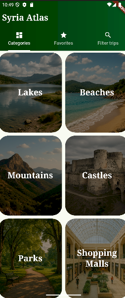
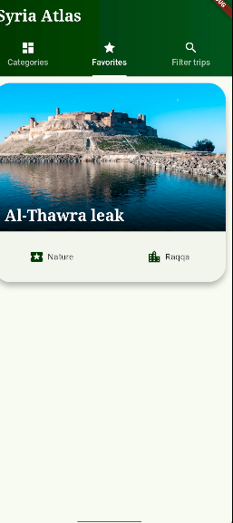
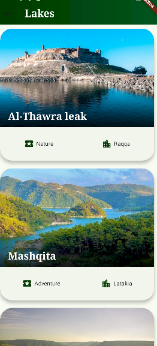
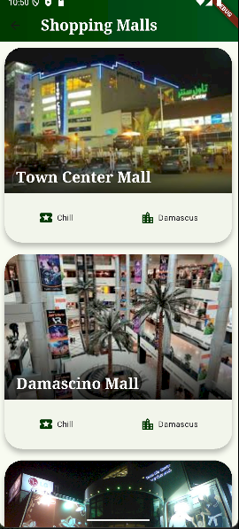
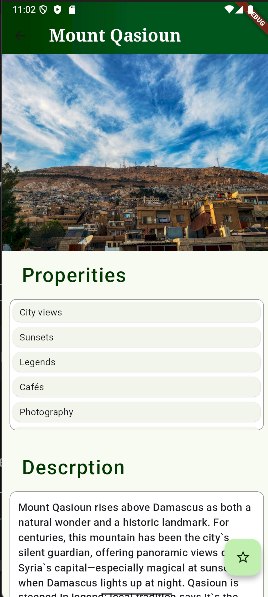

Syria Atlas
Syria Atlas is a Flutter-based mobile app designed to help you explore the best destinations in Syria—lakes, beaches, mountains, castles, parks, shopping malls, and more.
Discover natural wonders, historical sites, and modern attractions with just a few taps!

🌟 Features
Category Browsing:
Explore Syria’s top destinations by category (Lakes, Beaches, Mountains, Castles, Parks, Shopping Malls).

Visual Interface:
Each category features beautiful images and clear labels for easy navigation.

Trip Details:
View info cards for each destination, including images, type (nature, adventure, chill ..), location (governorate), and name.

Favorites:
Save your favorite trips for quick access later—perfect for trip planning or just dreaming.

Smart Filters:
Filter trips by season (summer/winter) for personalized suggestions.

Modern, Clean Design:
Intuitive UI with smooth navigation and clear layouts for a great user experience.

📱 Screenshots

Favorites	Filter Trips

🚀 How It Works
Browse Categories:
Start from the main menu to select a destination type (e.g., Lakes, Beaches).

Discover Trips:
Scroll through curated destinations in each category. See gorgeous images, quick info, and more.

Mark Favorites:
Tap the star icon to save a trip to your Favorites tab for easy access anytime.

Filter Trips:
Use the Filter tab to show only summer or winter-friendly destinations—super handy for seasonal planning.

🧩 Tech Stack
Flutter (cross-platform mobile)

Dart

Clean, widget-based architecture
💡 Why Syria Atlas?
Whether you’re a local explorer, tourist, or just curious about Syria’s natural beauty and attractions, Syria Atlas is your pocket guide for planning the perfect trip, exploring hidden gems, or reliving favorite memories. 

🛠️ Installation
git clone https://github.com/yourusername/syria-atlas.git
cd syria-atlas
flutter pub get
flutter run

🙌 Contributions
PRs are welcome! Feel free to submit issues, ideas, or improvements.

